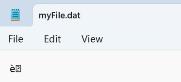
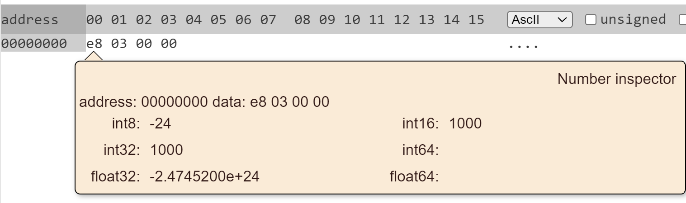
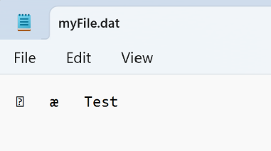
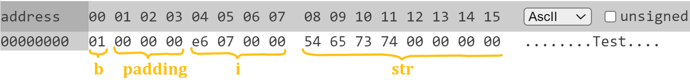

# Week 02. Двоични файлове
## Двоични файлове.
"Разбираеми" за компютъра, "неразбираеми" за нас.  

### Отваряне на двоичен файл
#### **За четене**
```c++
#include <iostream>
#include <fstream>

int main()
{
    std::ifstream file("myFile.dat", std::ios::binary);
    // ..
}
```

#### **За писане**
```c++
#include <iostream>
#include <fstream>

int main()
{
    std::ofstream file("myFile.dat", std::ios::binary);
    // ...
}
```

### Запис и четене на числа
#### **Записване на число**
```c++
#include <iostream>
#include <fstream>

int main()
{
    std::ofstream file("myFile.dat", std::ios::binary);

    if (!file.is_open())
    {
        std::cerr << "File can't be opened!" << std::endl;
        return -1;
    }

    int num = 1000;
    file.write(reinterpret_cast<const char*>(&num), sizeof(num));

    file.close();
}
```

Как изглежда файлът:



Отваряне с редактор, поддържащ двоичен формат:



#### **Прочитане на число**
```c++
#include <iostream>
#include <fstream>

int main()
{
    std::ifstream file("myFile.dat", std::ios::binary);
    if (!file.is_open())
    {
        std::cout << "File can't be opened!" << std::endl;
        return -1;
    }

    int toRead;
    file.read(reinterpret_cast<char*>(&toRead), sizeof(toRead));
    file.close();
}
```
Аналогично се извършва четенето и писането на други примитивни типове

#### **Записване и четене на статичен масив**
```c++
#include <iostream>
#include <fstream>

int main()
{
    std::ofstream file("myFile.dat", std::ios::binary);
    int arr[5] = {1, 2, 3, 4, 5};
    file.write(reinterpret_cast<const char*>(arr), sizeof(arr));
    file.close();
    
    std::ifstream inFile("myFile.dat", std::ios::binary);
    int readArr[5];
    inFile.read(reinterpret_cast<char*>(readArr), sizeof(readArr));
    inFile.close();
}
```

#### **Записване и четене на динамичен масив**
```c++
#include <iostream>
#include <fstream>

int main()
{
    std::ofstream file("myFile.dat", std::ios::binary);
    int size = 5;
    int* arr = new int[size]{10, 20, 30, 40, 50};

    // Запис на размера на масива
    file.write(reinterpret_cast<const char*>(&size), sizeof(size)); 

    // Запис на елементите
    file.write(reinterpret_cast<const char*>(arr), size * sizeof(int)); 
    
    file.close();
    delete[] arr;

    
    std::ifstream inFile("myFile.dat", std::ios::binary);

    // Чете размера на масива
    int readSize;
    inFile.read(reinterpret_cast<char*>(&readSize), sizeof(readSize));

    // Чете елементите
    int* readArr = new int[readSize];
    inFile.read(reinterpret_cast<char*>(readArr), readSize * sizeof(int));

    inFile.close();
    delete[] readArr;
}
```

### Запис и четене на структури
#### **Записване на структура без динамична памет**
```c++
#include <iostream>
#include <fstream>

const unsigned MAX_SIZE = 1024;
struct Test
{
    bool b;
    int i;
    char str[MAX_SIZE];
};

int main()
{
    std::ofstream file("myFile.dat", std::ios::binary);
    Test test{ true, 2022, "Test" };
    // Запис на цялата структура наведнъж
    file.write(reinterpret_cast<const char*>(&test), sizeof(test)); 
    file.close();
}
```

Как изглежда файлът:



Отваряне с редактор, поддържащ двоичен формат:




#### **Записване и четене на структура с динамична памет**
```c++
#include <iostream>
#include <fstream>
#include <cstring>

struct Student
{
    int age;
    int facultyNumber;
    size_t nameLength;
    char* name;
};

int main()
{
    std::ofstream file("myFile.dat", std::ios::binary);
    Student s{ 20, 12345, 6, new char[6]{'A', 'l', 'i', 'c', 'e', '\0'} };
    
    // Запис на статичните части
    file.write(reinterpret_cast<const char*>(&s.age), sizeof(s.age));
    file.write(reinterpret_cast<const char*>(&s.facultyNumber), sizeof(s.facultyNumber));
    file.write(reinterpret_cast<const char*>(&s.nameLength), sizeof(s.nameLength));
    
    // Запис на динамичната част (низ)
    file.write(s.name, s.nameLength);
    file.close();
    delete[] s.name;
    
    std::ifstream inFile("myFile.dat", std::ios::binary);
    Student readS;
    
    // Четене на статичните части
    inFile.read(reinterpret_cast<char*>(&readS.age), sizeof(readS.age));
    inFile.read(reinterpret_cast<char*>(&readS.facultyNumber), sizeof(readS.facultyNumber));
    inFile.read(reinterpret_cast<char*>(&readS.nameLength), sizeof(readS.nameLength));
    
    // Четене на динамичната част
    readS.name = new char[readS.nameLength];
    inFile.read(readS.name, readS.nameLength);
    inFile.close();
    
    delete[] readS.name;
}
```

### Защо динамичните структури изискват отделни записи?
При динамичните структури указателите съхраняват **адреси**, а не самите данни. Ако записваме структурата наведнъж, в двоичния файл ще се запишат адресите, което прави файла безполезен при четене. Затова:
- **Записваме първо фиксираните части** (числа, размери и т.н.).
- **Записваме динамичните данни отделно**, за да можем правилно да ги възстановим при четене.

Повече за различните видове C++ cast-ване: https://cplusplus.com/articles/iG3hAqkS/

---
## Задачи
Задача 1: Колекция от студенти:

    * Всеки студент има: име - низ с максимална дължина 100, години и среден успех.

Да се напише програма, която:
1. Записва колекция от студенти в двоичен файл,
2. Чете колекция от студенти от двоичен файл.
3. **Tърси по име** студент от колекция, записана в двоичен файл и **отпечатва неговата информация**. Решението да не чете наведнъж цялата колекция от студенти в паметта.
4. **Променя запис на студент** в двоичен файл: по подадено име и нов среден успех, намира студента с указаното име и запазва новия успех
5. **Изтрива студент**: по подено име на студент, изтрива всички студенти в колекцията във файла с това име.