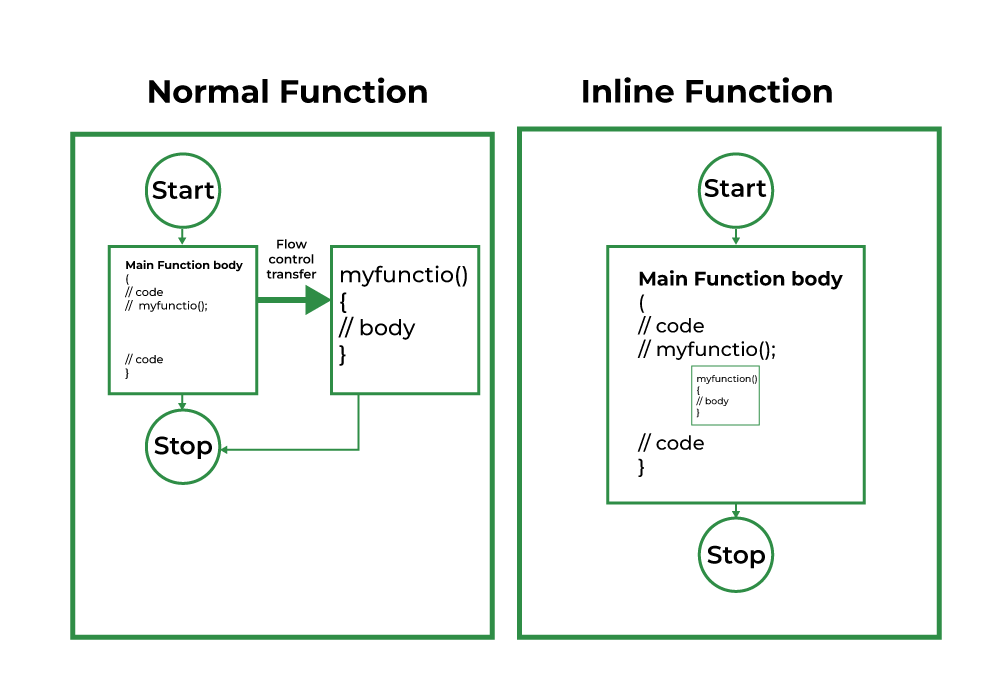
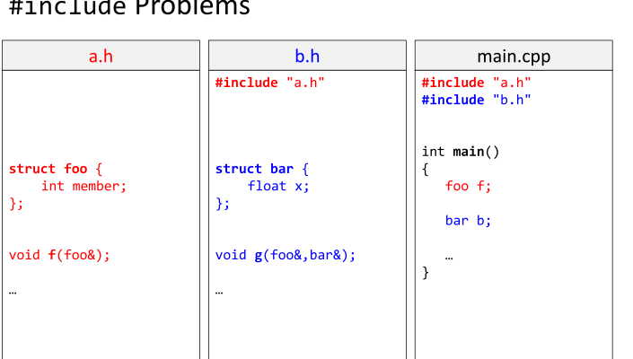
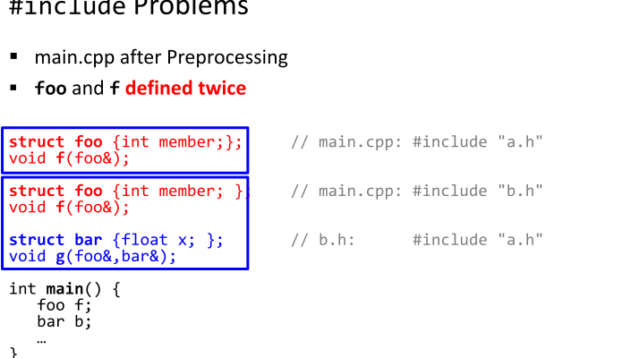
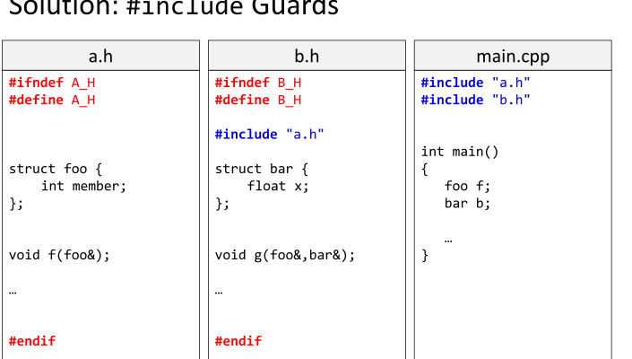
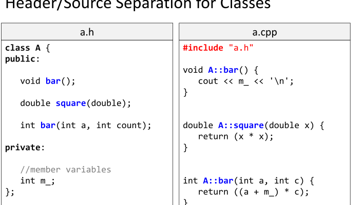
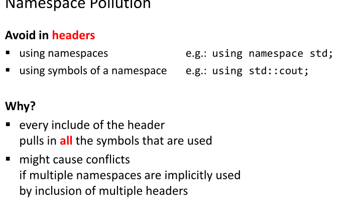

# Какво е OOП?
**Обектно-ориентираното програмиране (_ООП_)** е парадигма в компютърното програмиране, при която една програмна система се моделира като набор от обекти, които взаимодействат помежду си.

---
# struct и class

`struct` и `class` в C++ са потребителски дефинирани типове, които позволяват групиране на свързани данни и функционалност. `struct` се използва предимно за агрегиране на данни, като всички членове са `public` по подразбиране. `class` предоставя по-добра eнкапсулация, като членовете са `private` по подразбиране, което позволява скриване на вътрешната реализация и контрол над достъпа.

*Пример*

```cpp
struct Person {
	unsigned age;
	char* firstName;
	char* lastName;
};
```

```cpp
class Car { 
private: 
	// Конструктор
	unsigned horsePower; 
	char* brand; 
	char* model; 
	unsigned short seats; 
public: 
	// Конструктор
	Car(unsigned hp, const char* br, const char* mod, unsigned short s) :               horsePower(hp),
	 brand(new char[strlen(br) + 1]), 
	 model(new char[strlen(mod) + 1]), 
	 seats(s) { 
		strcpy(brand, br); 
		strcpy(model, mod); 
	}
	
	// Деструктор
	~Car() { 
		delete[] brand; 
		delete[] model; 
	} 
};
```

## Конструктор
Конструкторът е специален метод в C++, който се извиква автоматично при създаването на обект и служи за неговата инициализация. Има същото име като класа и няма връщан тип.

*Пример*
```cpp
class Rectangle { 
private: 
	int width, height;
public:
	Rectangle(int w, int h) : width(w), height(h) {} 
	int getArea() { return width * height; } 
};
```


За разликата между struct и class, `public`, `private`, `protected`, конструктори, деструктори и т.н. ще говорим много подробно в следващите занятия. Засега ще използваме struct.

# Основни принципи на ООП
## 1. Encapsulation (Енкапсулация)
Енкапсулацията е концепция, при която данните на обект (член-данни, полета) са защитени от пряк достъп и могат да се модифицират само чрез методи на същия клас. Това осигурява **скриване на информацията** (data hiding) и намалява риска от неоторизирана промяна.
## 2. Abstraction (Абстракция)
Абстракцията е процесът на отделяне на съществените характеристики на обектите от несъществените детайли. Чрез абстракция се моделират реалните обекти чрез дефиниране на техните основни свойства и поведение, без да се навлиза в подробности за тяхната имплементация.
## 3. Inheritance (Наследяване)
Наследяването позволява създаването на нови класове, които наследяват свойствата и поведението на вече съществуващи класове (базови, родителски класове). Това улеснява повторната употреба на кода и създаването на йерархии от класове, където новите класове могат да добавят или променят функционалността на базовия клас.

*Пример*
```cpp
#include <iostream>

// Базов клас Vehicle
class Vehicle {
public:
    void honk() const {
        std::cout << "Vehicle: Honk! Honk!" << std::endl;
    }
};

// Клас Car, който наследява от Vehicle
class Car : public Vehicle {
public:
    void drive() const {
        std::cout << "Car: Driving..." << std::endl;
    }
};

class Truck : public Vehicle { 
public: 
	void loadCargo() const { 
		std::cout << "Truck: Loading cargo..." << std::endl; 
	} 
};

int main() {
    Car myCar;
    myCar.honk();  // Използване на наследения метод от Vehicle
    myCar.drive(); // Използване на метода от Car
    return 0;
}

```

## 4. Polymorphism (Полиморфизъм)
Полиформизмът позволява обекти от различни класове да бъдат третирани като обекти от общ базов клас. Това се постига чрез използването на виртуални функции, които позволяват на всеки клас да предостави своя собствена имплементация на даден метод, осигурявайки гъвкавост и разширяемост на кода.

*Пример*

```cpp
#include <iostream>
#include <vector>

// Абстрактен базов клас Shape с чисто виртуална функция draw()
class Shape {
public:
    virtual void draw() const = 0; // Чисто виртуална функция
    virtual ~Shape() {} // Виртуален деструктор
};

class Circle : public Shape {
public:
    void draw() const override {
        std::cout << "Drawing a Circle" << std::endl;
    }
};

class Rectangle : public Shape {
public:
    void draw() const override {
        std::cout << "Drawing a Rectangle" << std::endl;
    }
};

class Triangle : public Shape {
public:
    void draw() const override {
        std::cout << "Drawing a Triangle" << std::endl;
    }
};

int main() {

    vector<Shape*> shapes;
    shapes.push_back(new Circle());
    shapes.push_back(new Rectangle());
    shapes.push_back(new Triangle());

    // Извикваме метода draw() за всеки обект
    // Динамичното свързване гарантира извикването на правилната имплементация за всеки производен клас.
    for (const auto& shape : shapes) {
        shape->draw();
    }

    for (auto shape : shapes) {
        delete shape;
    }
    
    shapes.clear();

    return 0;
}

```

# Inline функции
Inline функциите са функции, чието тяло се вмъква директно на мястото на всяко извикване от компилатора. Това намалява разходите по време на извикване на функцията, особено ако тя е малка и се извиква многократно, като така се оптимизира производителността.

*Пример*

```cpp
#include <iostream>

inline int add(int a, int b) {
	return a + b;
}

int main() {
	std::cout << "Sum: " << add(3, 4) << std::endl;
	std::cout << "Sum: " << add(5, 6) << std::endl;
}
```




Източник: https://www.geeksforgeeks.org/inline-functions-cpp/

---

# Разделна компилация. Препроцесор и основни директиви

## Защо е нужна?
Проблеми:
- Хиляди редове код при големи проекти
- Много програмисти работят върху един проект
- Нужда от малко време за компилиране
Решение:
- разделяме кода в различни файлове
- компилираме разделно и само когато сме направили промяна!


## Директиви:

- `#include` – включване на други файлове.
- `#define` – дефиниране на макроси.
- `#ifndef`, `#define`, `#endif` – предпазване от многократно включване на един и същи header файл. (наричат се **header guards**)

## Защо са ни нужни **header guards**?







Източник: https://hackingcpp.com/cpp/lang/separate_compilation.html


---


# Задачи 

# Задача 1.
Създайте структура `ComplexNumber`, която представя комплексно число. Създайте член-функции, които събират, изваждат и умножават комплексни числа. Създайте и подходяща функция за извеждане на комплексното число на конзолата.

---
# Задача 2.
Създайте структура `Time`, която представя време, състоящо се от час, минути исекунди.  Създайте член-функции, която добавя секунди/минути/часове към съотвеното време. Създайте функция, която сравнява две различни структури `Time`.

---
# Задача 3.
Създайте структура `Employee`, която съдържа информация за служител (име, позиция, заплата, трудов стаж.) Създайте функция, която изчислява годишния бонус на служителя. Създайте функция, която извежда цялата информация за служителя.
бонус=заплата×100(трудов стаж+1)​

$$
\text{бонус} = \text{заплата} \times \frac{(\text{трудов стаж} + 1)}{100}
$$


---

Успешен семестър! 🙂


