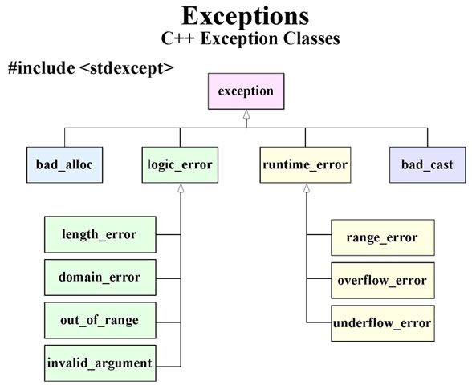

# Exceptions
Изключенията са начин програмите да реагират на неочаквани ситуации, като например грешки по време на изпълнение. Когато възникне такъв проблем, управлението на програмата се прехвърля към специални функции, наречени обработчици на изключения (handlers).

За да уловим изключения, обграждаме съответния код в `try` блок. Ако в този блок се случи грешка, програмата „хвърля“ изключение, което автоматично се насочва към handler. Ако не възникне изключение, кодът се изпълнява нормално, без да се активират обработчиците.

Изключенията се хвърлят с ключовата дума `throw` вътре в `try` блока. Handler-ите се задават с `catch` и трябва да стоят веднага след `try` блока.

NB! Изключенията могат да бъдат хвърляни и извън `try` блокове, а обработката им може да се случва в `caller` функция (функцията от която са били извикани).

Пример:
```cpp
#include <iostream>
#include <stdexcept>

void divide(int a, int b) {
    try {
        if (b == 0) {
            throw std::runtime_error("Cannot divide by zero!");
        }
        std::cout << "Result: " << a / b << std::endl;
    } catch (const std::runtime_error& e) {
        std::cerr << "Caught exception: " << e.what() << std::endl;
    }
}

int main() {
    divide(10, 2);  
    divide(5, 0); 
    return 0;
}

```




---

# Какво е Unit Testing?
• Unit test е код, който изпълнява специфична, "атомарна" (т.е. която не може да се разбие по
смислен начин на по-малки) функционалност на кода, която да бъде тествана
• Един unit test цели да тества малък фрагмент код - обикновено един метод

## Test-Driven Development
**Test-Driven Development (TDD)** е методология за разработка на софтуер, при която първо се пишат **тестове**, а след това се имплементира кодът, който ги изпълнява.

---

За Unit Testing ще използваме библиотеката *Catch2*. Пълната документация може да намерите тук:
[Catch2 reference](https://github.com/catchorg/Catch2/tree/devel/docs)
[Линк към хедър файла](https://github.com/catchorg/Catch2/releases/download/v2.13.7/catch.hpp)
[Примери](https://github.com/catchorg/Catch2/blob/devel/docs/list-of-examples.md)


Пример
```cpp
#define CATCH_CONFIG_MAIN
#include <catch2/catch.hpp>
#include <stdexcept>

class Calculator {
public:
    double add(double a, double b) {
        return a + b;
    }

    double subtract(double a, double b) {
        return a - b;
    }

    double multiply(double a, double b) {
        return a * b;
    }

    double divide(double a, double b) {
        if (b == 0) {
            throw std::invalid_argument("Cannot divide by zero!");
        }
        return a / b;
    }
};

TEST_CASE("Calculator Tests") {
    Calculator calc;

    SECTION("Addition works correctly") {
        REQUIRE(calc.add(2, 3) == 5);  
        REQUIRE(calc.add(-1, 1) == 0);
    }

    SECTION("Subtraction works correctly") {
        REQUIRE(calc.subtract(5, 3) == 2);  
        REQUIRE(calc.subtract(0, 5) == -5);
    }

    SECTION("Multiplication works correctly") {
        REQUIRE(calc.multiply(2, 3) == 6);  
        REQUIRE(calc.multiply(-2, 3) == -6); 
    }

    SECTION("Division works correctly") {
        REQUIRE(calc.divide(6, 2) == 3);   
        REQUIRE(calc.divide(0, 5) == 0); 
    }

    SECTION("Division by zero throws an exception") {
        REQUIRE_THROWS_AS(calc.divide(5, 0), std::invalid_argument);
    }
    
    SECTION("Negative numbers in addition") {
        REQUIRE(calc.add(-5, -5) == -10); 
    }

    SECTION("Negative numbers in subtraction") {
        REQUIRE(calc.subtract(-10, -5) == -5);
    }

    SECTION("Large numbers") {
        REQUIRE(calc.add(1000000, 2000000) == 3000000);
    }
}

```


*Разлика между REQUIRE и CHECK*:
```cpp
TEST_CASE("REQUIRE stops execution") {
    int x = 5;
    REQUIRE(x == 5);  // Този тест ще продължи, защото условието е вярно.
    
    REQUIRE(x == 10); // Тестът ще спре тук, защото условието е грешно.
    
    // Този ред никога няма да се изпълни.
    REQUIRE(2 + 2 == 4);
}

TEST_CASE("CHECK allows further execution") {
    int y = 3;
    CHECK(y == 3);   // Този тест ще продължи, защото условието е вярно.
    
    CHECK(y == 10);  // Този тест ще се провали, но изпълнението ще продължи.
    
    // Този ред ще се изпълни, дори ако предната проверка е грешна.
    CHECK(2 + 2 == 4);
}
```


---

# Задача:

**Описание:**

Създайте клас `BankAccount`, представящ банкова сметка. Смектата трябва да поддържа баланс, който може да се увеличава чрез депозит и намалява чрез теглене или преводи към друга сметка. Всяка банкова сметка трябва да има уникален идентификатор.

- Банковата сметка трябва да позволява:
    - Депозиране на пари.
    - Изтегляне на пари.
    - Прехвърляне към друга сметка
    - Преглеждане на текущия баланс.
- Банковата сметка има следните изисквания:
    - Не може да се изтеглят повече пари от наличния баланс.
    - Не може да се извърши депозит с отрицателна стойност.
- Класът трябва да хвърля грешки:
    - ако се опитате да изтеглите повече пари от наличния баланс.
    - ако се опитате да депозирате отрицателна сума.

Напишете unit тестове с помощта на `Catch2` библиотеката. Опитайте се да работите по метода *Test-Driven Development*

*Бонус задача*: Записвайте всяка трансакция в текстов файл във вида:
`<bank_account_id>: <type of transaction> <sum>`